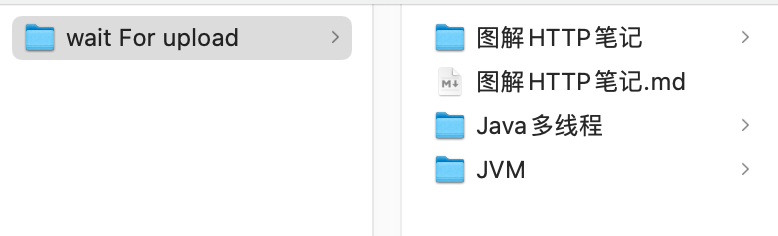
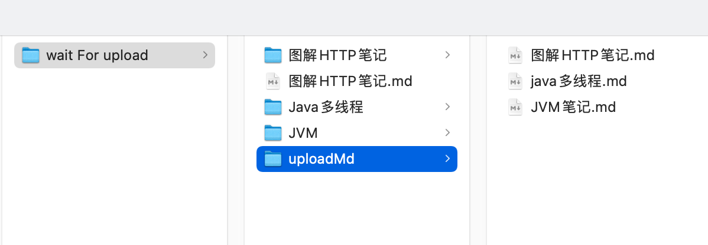
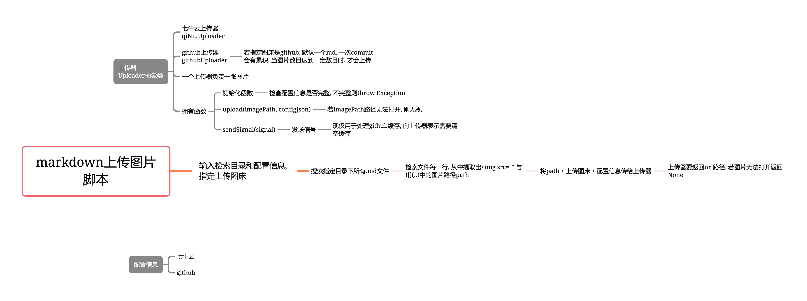

##md文件图片上传 脚本

#### 适用场景

想有一个跟本地md内容一模一样的md, 但其中的图片已经上传到图床上, 并且路径已经替换完成.

例子:



我想将 `wait For upload` 目录下所有后缀.md文件中的图片, 上传到图床中, 并复制一份md, 并且复制后的md, 图片路径已经替换成图床路径.

将 `md_dir` 配置为 `wait For upload`目录路径, 运行脚本

得到  `uploadMd` 文件夹



此时该文件夹中包含的md, 与对应原md的内容一样, 只不过图片路径已经替换为图床路径.


#### 使用方法

1. 在 `config.json` 中配置好相关信息

    ```json
    {
      "type": "github",
       // 脚本会搜索指定目录下所有后缀.md的文件
      "md_dir": "/Users/chenyuanzhen/hexo/blog/source/_posts",
      "qiniu": {
        "access_key": "",
        "secret_key": "",
        "bucket_name": "",
        "host_name": "",
        "external_domain_name": "ra4lzizzb.bkt.clouddn.com"
      },
      "github": {
        // commit信息, 只要有即可
        "commit_message": "python upload image",
        // 请在github -> settings -> Developer settings -> Personal access tokens中生成
        "access_token": "",
        "owner": "仓库所有者",
        "repo_name": "仓库名",
        "branch": "分支名",
        // remote_prefix_path 不可为空
        // 图片上传路径 branch/image/a.png
        "remote_prefix_path": "image",
        // 当要上传图片数目 > cacheSize时, 才会一次性上传并视为一次commit
        "cacheSize": 15
      }
    }
    ```

2. 运行 `main.py` 文件

    

#### 注意事项

1. 该脚本仅在`github图床 + linux路径` 下测试成功过

    而在 `windows路径` 下尚未测试, 但代码中采用的 `python` 的 `os` 包处理路径, 应该也是支持的

    七牛云图床, 暂未进行测试

2. 该脚本是不会记录上传过的图片, 也就是说只要待上传的图片是可以打开, 都会执行上传

    > 若`md`图片路径已是图床路径, 则会无视. 


#### 脚本逻辑流程图




#### 使用第三方包

- github python API
